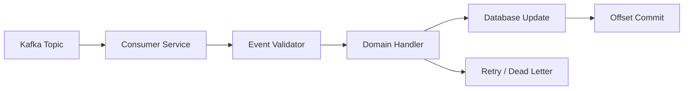

# Event-Driven Kafka Consumer Processing

## Problem
When external systems publish events, the wallet service must consume them reliably and apply updates without losing or duplicating work.

## Approach
- Built Kafka consumers for key domains such as incentives, trips, and user changes.
- Added validation, transformation, and idempotent handlers.
- Managed offsets explicitly to support at-least-once semantics with safe retries.

## Architecture


## What to highlight
- Event handling architecture for reliable processing
- Idempotency and offset commit behavior
- How invalid or duplicate events are isolated
- Example metrics: events per second, processing latency, error rate

## Sample Code

### Kafka consumer handler (safe & idempotent)
```go
func HandleIncentiveCreated(ctx context.Context, repo Repository, msg []byte) error {
    var ev IncentiveCreated
    if err := json.Unmarshal(msg, &ev); err != nil { return err }

    // idempotency using event id
    if repo.EventProcessed(ctx, ev.ID) { return nil }

    // business logic: credit wallet, create record
    if err := repo.CreditWallet(ctx, ev.UserID, ev.Amount); err != nil { return err }
    return repo.MarkEventProcessed(ctx, ev.ID)
}
```

## Key takeaways
- **At-least-once delivery:** Design handlers to be idempotent; processing the same event twice is safe
- **Event ID tracking:** Use unique event IDs as idempotency guards to prevent duplicate effects
- **Offset management:** Commit offsets only after successful processing; failed messages can be retried
- **Separation of concerns:** Validate, transform, and apply events in distinct stages for clarity and testability
- **Dead-letter handling:** Route failed or invalid events to a separate queue for investigation
