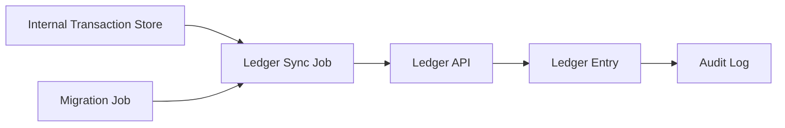

# CLedger Sync & Data Migration

## Problem
A wallet platform must keep its internal transaction records aligned with an external ledger and migrate historical financial data safely.

## Approach
- Implemented scheduled ledger sync jobs and migration tooling.
- Added validation and audit trails for each sync operation.
- Designed migrations to be restartable and idempotent.

## Architecture


## What to highlight
- Safe backfill and reconciliation for historical data
- Idempotent sync jobs and gap recovery
- Auditability of ledger operations
- Example metrics: records synced per run, migration success rate, reconciliation discrepancies

## Sample Code

### Ledger sync job (batch, idempotent, restartable)
```go
func RunLedgerSync(ctx context.Context, repo Repository, ledger LedgerClient) error {
    pending, err := repo.FetchUnsyncedTransactions(ctx, 100)
    if err != nil { return err }

    for _, t := range pending {
        // send with retry/backoff (implementation detail hidden)
        if err := ledger.SubmitEntry(ctx, t.ToLedgerEntry()); err != nil {
            // log and continue; job will pick it up next run
            log.Printf("ledger submit failed for %s: %v", t.ID, err)
            continue
        }
        // mark synced (idempotent): safe to call multiple times
        if err := repo.MarkTransactionSynced(ctx, t.ID); err != nil {
            log.Printf("mark synced failed for %s: %v", t.ID, err)
        }
    }

    return nil
}
```

## Key takeaways
- **Scheduled batch jobs:** Sync large volumes of records using periodic cronjobs with backoff
- **Idempotent updates:** Mark records as synced in a way that allows safe replay if the job restarts
- **Partial failure handling:** Continue processing remaining records even if some fail; retry next run
- **Audit trail:** Log each sync attempt and result for compliance and debugging
- **Migration checkpointing:** Break migrations into phases; track progress to recover from mid-migration failures
