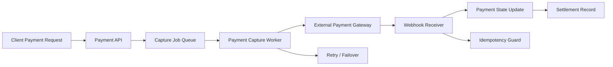

# Payment Capture & Settlement Workflow

## Problem
A digital wallet service must capture payments reliably, handle external payment gateway failures, and keep settlement state synchronized without losing money or processing duplicates.

## Approach
- Designed an asynchronous payment workflow that separates API request handling from gateway interactions.
- Added idempotent capture jobs, retry/backoff, and webhook reconciliation.
- Kept final payment state in the wallet system and reconciled against gateway callbacks.

## Architecture


## What to highlight
- Safe handling of transient gateway failures
- Idempotent retries and duplicate webhook protection
- Separation between request handling and external integration
- Example metrics: success/failure ratio, average capture latency, retry counts

## Sample Code

### Payment capture worker (idempotent)
```go
// enqueue capture job (example)
func EnqueueCapture(ctx context.Context, repo Repository, paymentID string, amount int64) error {
    job := CaptureJob{PaymentID: paymentID, Amount: amount}
    return repo.Enqueue("capture_jobs", job)
}

// worker processing (idempotent guard)
func ProcessCaptureJob(ctx context.Context, repo Repository, job CaptureJob) error {
    // idempotency: return early if already processed
    if repo.PaymentProcessed(ctx, job.PaymentID) {
        return nil
    }

    // call external gateway (pseudo-call, no secrets shown)
    res, err := ExternalGatewayCapture(ctx, job.PaymentID, job.Amount)
    if err != nil {
        return err // worker/queue will retry according to policy
    }

    // persist final state atomically
    return repo.MarkPaymentProcessed(ctx, job.PaymentID, res.Status)
}
```

## Key takeaways
- **Asynchronous decoupling:** Separate request handling from slow external gateway calls
- **Idempotency:** Use a guard to prevent duplicate processing when jobs or webhooks retry
- **Webhook reconciliation:** Validate and map incoming webhooks to internal payments safely
- **Failure resilience:** Retry failed captures with backoff; gracefully handle partial failures
