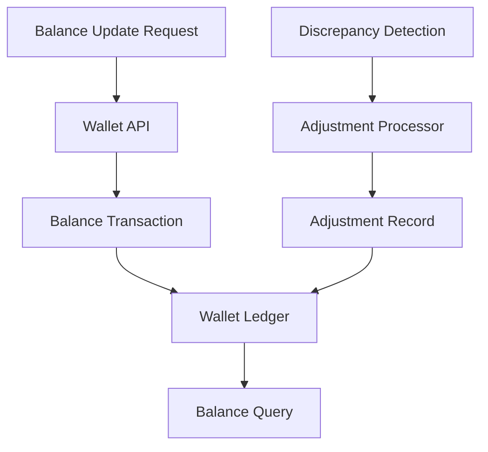

# Wallet Balance Consistency & Adjustments

## Problem
A financial service must maintain consistent wallet balances while supporting adjustments and corrections across many account operations.

## Approach
- Modeled a wallet ledger and adjustment pipeline to keep account balances correct.
- Used transactional balance updates plus a scheduled adjustments processor for corrective actions.
- Captured each adjustment separately to preserve history and auditability.

## Architecture


## What to highlight
- Data model for wallet accounts and adjustment history
- Use of scheduled reconciliation to detect and fix drift
- Audit-friendly adjustment records
- Example metrics: balance drift rate, reconciled discrepancy count, adjustment processing volume

## Sample Code

### Wallet adjustment (transactional)
```go
// apply adjustment in a DB transaction and record audit
func ApplyAdjustment(ctx context.Context, db DB, accountID string, delta int64, reason string) error {
    return db.WithTx(ctx, func(tx TX) error {
        balance, err := tx.GetBalance(ctx, accountID)
        if err != nil { return err }

        if balance+delta < 0 {
            return fmt.Errorf("insufficient funds")
        }

        if err := tx.UpdateBalance(ctx, accountID, balance+delta); err != nil { return err }
        return tx.InsertAdjustmentRecord(ctx, accountID, delta, reason)
    })
}
```

## Key takeaways
- **Atomic transactions:** Ensure balance updates and audit records are always consistent
- **Adjustments as first-class records:** Each correction is logged for auditability and reconciliation
- **Scheduled drift detection:** Run periodic checks to catch discrepancies early
- **Transactional safety:** Use database transactions to prevent race conditions on balance updates
